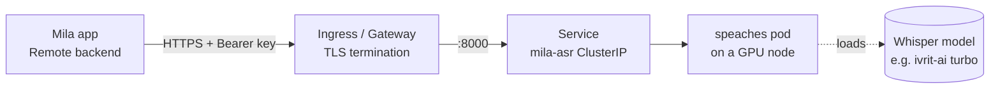

# Self-hosting a shared Mila transcription server on Kubernetes

This guide walks a team through standing up **one shared GPU transcription
server** that everyone's Mila can point at, instead of every Mac transcribing
on-device. The server is [**speaches**](https://github.com/speaches-ai/speaches)
— an OpenAI-compatible speech-to-text server built on
[faster-whisper](https://github.com/SYSTRAN/faster-whisper) — running a Whisper
model on an NVIDIA GPU. Mila talks to it through its **Remote** backend, which
speaks OpenAI's [`POST /v1/audio/transcriptions`](https://platform.openai.com/docs/api-reference/audio/createTranscription)
API.

Why do this:

- **One GPU, many users.** A single T4 comfortably serves a team's short
  recordings; nobody needs a fast Mac or waits on local transcription.
- **Any Whisper model.** Load a Hebrew fine-tune like
  [`ivrit-ai/whisper-large-v3-turbo-ct2`](https://huggingface.co/ivrit-ai/whisper-large-v3-turbo-ct2),
  or a multilingual model such as
  [`Systran/faster-whisper-large-v3`](https://huggingface.co/Systran/faster-whisper-large-v3)
  — anything published in [CTranslate2](https://github.com/OpenNMT/CTranslate2)
  form.
- **You control the data.** Audio goes to a server you run, not a third party.

> **Just want to try it on one machine first?** See
> [`../REMOTE_TRANSCRIPTION_SERVER.md`](../REMOTE_TRANSCRIPTION_SERVER.md) for a
> single-host `docker run` quickstart and the OpenAI-hosted-Whisper option. This
> guide is the production, shared-on-Kubernetes version of the same thing.

> **Every value here is a placeholder.** There are no real keys, hostnames, or
> accounts in this folder. Fill in your own as you go.

---

## Architecture



The client sends audio over HTTPS with an API key; your ingress terminates TLS
and forwards to the in-cluster `Service`, which routes to the speaches pod
pinned to a GPU node.

---

## Prerequisites

- A **Kubernetes cluster** with at least one **NVIDIA GPU node** (an AWS
  `g4dn.xlarge` / T4 is plenty and cheap; anything with a modern NVIDIA GPU
  works).
- The **[NVIDIA device plugin](https://github.com/NVIDIA/k8s-device-plugin)**
  installed so that `nvidia.com/gpu` is a schedulable resource. (Managed GPU
  node pools on GKE/AKS/EKS and AWS Bottlerocket GPU AMIs bundle this. Run
  `kubectl describe node <gpu-node> | grep nvidia.com/gpu` to confirm it shows
  up under Capacity.)
- **`kubectl`** configured against the cluster.
- An **ingress path** you already know how to use (an Ingress controller, the
  Gateway API, or a cloud LoadBalancer) to expose the service over HTTPS.

The manifests referenced below live in [`k8s/`](./k8s).

---

## Step 1 — Create the namespace

```bash
kubectl apply -f k8s/namespace.yaml
```

## Step 2 — Create the API-key Secret

speaches gates its endpoint behind an API key (Mila sends it as a Bearer
token). Create a Secret with a key of your choosing — **do not commit it**:

```bash
kubectl -n mila-asr create secret generic mila-asr-secrets \
  --from-literal=API_KEY="$(openssl rand -hex 32)"
```

Grab the value you generated (you'll paste it into Mila later):

```bash
kubectl -n mila-asr get secret mila-asr-secrets \
  -o jsonpath='{.data.API_KEY}' | base64 --decode; echo
```

> [`k8s/secret.example.yaml`](./k8s/secret.example.yaml) is a template if you'd
> rather define the Secret declaratively — just keep the filled-in copy out of
> version control.

## Step 3 — Deploy speaches

```bash
kubectl apply -f k8s/deployment.yaml
kubectl apply -f k8s/service.yaml
```

What the [Deployment](./k8s/deployment.yaml) does:

- Runs the upstream `ghcr.io/speaches-ai/speaches:0.9.0-rc.3-cuda` image and
  **requests 1 GPU** (`nvidia.com/gpu: "1"`) with a toleration so it lands on a
  tainted GPU node.
- Sets `WHISPER__COMPUTE_TYPE=float16` for good accuracy at roughly half the
  VRAM of float32.
- Uses `/health` for the startup / readiness / liveness probes (that endpoint is
  auth-free on this image).
- Runs a **`postStart` hook** that waits for the server, then pre-registers the
  model (`POST /v1/models/{id}`) so the first user request doesn't pay the full
  cold download. It's non-fatal — speaches also lazy-loads on first use.
- Caches the model in a pod-local **`emptyDir`** (re-downloaded on restart,
  ~1–2 min; swap for a PVC if you want it to persist).

**Changing the model:** edit the `model_id` in the deployment's `postStart`
hook and set the matching id in your `.milaconfig` / Mila settings. For a
multilingual deployment use `Systran/faster-whisper-large-v3`.

Watch it come up (the first boot downloads the model, so give it a few minutes):

```bash
kubectl -n mila-asr rollout status deploy/mila-asr
kubectl -n mila-asr logs -f deploy/mila-asr
```

> **No GPU node yet?** If you run AWS + Karpenter, `k8s/gpu-nodepool.example.yaml`
> shows how we provision a dedicated on-demand T4 node just for this workload.
> It's **optional and AWS-specific** — skip it entirely if your cluster already
> has GPU nodes.

## Step 4 — Expose it

The service listens on `:8000` inside the cluster. Put it behind HTTPS however
your cluster normally does. [`k8s/ingress.example.yaml`](./k8s/ingress.example.yaml)
contains a **Gateway API `HTTPRoute`** (what we run) plus a commented standard
`Ingress` alternative — **adapt it to your setup**, don't apply it blindly:

- Set your real **hostname** (replace `mila-asr.your-org.example`).
- Point it at **your** Gateway / IngressClass.
- **Terminate TLS** at the ingress or load balancer. Keep the API-key check on;
  never send audio over plaintext HTTP across an untrusted network.

```bash
# after editing it for your environment:
kubectl apply -f k8s/ingress.example.yaml
```

## Step 5 — Verify with `curl`

Health check (should return `200`, no auth needed — speaches serves `/health`
at the root, and the example route forwards `/`):

```bash
curl -i https://mila-asr.your-org.example/health
```

End-to-end transcription (needs the Bearer key and an audio file):

```bash
curl https://mila-asr.your-org.example/v1/audio/transcriptions \
  -H "Authorization: Bearer YOUR_API_KEY_HERE" \
  -F file=@sample.m4a \
  -F model=ivrit-ai/whisper-large-v3-turbo-ct2 \
  -F language=he \
  -F response_format=verbose_json
```

A JSON response with a `text` field (and per-segment timestamps) means you're
in business.

## Step 6 — Point Mila at it

In Mila: **Settings → Models → Remote**.

| Field    | Value                                     |
| -------- | ----------------------------------------- |
| Backend  | **Remote**                                |
| Base URL | `https://mila-asr.your-org.example/v1`    |
| Model    | `ivrit-ai/whisper-large-v3-turbo-ct2`     |
| API key  | the key you created in Step 2             |

Click **Test connection**. Once it's green, record — Mila uploads each recording
and asks for `verbose_json`, so timestamps (and therefore SRT export + speaker
diarization) keep working exactly as with the local engine.

---

## Handing the config to your team with `.milaconfig`

Typing the base URL, model, and key into every teammate's Mila is tedious.
Mila reads **`.milaconfig`** files: double-clicking one applies the settings it
contains. It's a **partial override** — fields that are *present* update the
matching setting; fields that are *absent* are left untouched. So a file that
only carries the remote-server block won't disturb anyone's hotkeys, language,
or anything else.

See [`example.milaconfig`](./example.milaconfig):

```json
{
  "version": 1,
  "remoteTranscription": {
    "enabled": true,
    "endpoint": "https://mila-asr.your-org.example/v1",
    "model": "ivrit-ai/whisper-large-v3-turbo-ct2",
    "apiKey": "YOUR_API_KEY_HERE"
  },
  "recordingLanguage": "he"
}
```

To distribute it:

1. Copy `example.milaconfig`, fill in your real `endpoint` and `apiKey` (and
   drop `recordingLanguage` if you don't want to force a default language).
2. Hand the file to your users (shared drive, chat, etc.).
3. They double-click it; Mila confirms and applies the settings. The API key is
   stored in the macOS Keychain, never in plain UserDefaults.

> The `.milaconfig` file contains your API key in plaintext — share it over a
> trusted channel, the same way you'd share any credential.

---

## Notes & operational tips

- **Always-on, single replica.** A single GPU hosts exactly one pod, so the
  Deployment uses the `Recreate` strategy (no rolling surge). To save money
  off-hours you can scale it to 0 and let your autoscaler drop the GPU node;
  the model re-downloads on the next start (the `postStart` hook covers it).
- **`/health` is auth-free** on the `0.9.0-rc.3` image — that's why the probes
  work without the key. If you bump the image tag, re-check that `/health`
  stays unauthenticated, or the probes will fail.
- **Privacy.** With the Remote backend active, audio leaves the device. Mila
  flags this in the UI. Self-hosting keeps it on infrastructure you control.
- **Diarization still runs locally** in Mila (it reads the on-disk audio), so
  speaker labels work regardless of which transcription backend you pick.
- **Language.** Mila forwards the recording language (`he` / `en`); on
  Auto-detect it omits the field and lets the server detect it.
